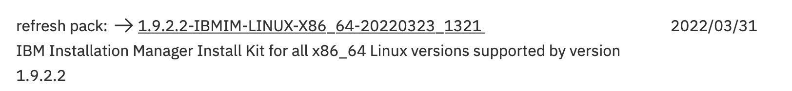

This HOWTO will install Centos on VirtualBox for Mac, in preparation for installing OMNIbus. It assumes you know your way around Linux. 

The easy way, which avoids all the installation and configuration, is to download a working VirtualBox image here: [https://ibm.box.com/s/r0iqhgf7qjemz274qrbty25lxc6cevd3](https://ibm.box.com/s/r0iqhgf7qjemz274qrbty25lxc6cevd3){:target="_blank"}. Fire it up and just run through the tests for starting the objectserver and posting messages. NOTE: the user is `ibmer`. The password for that user and for root is `password`.

If you'd like the experience of installing and configuring, which I found very helpful because it's what our customers do, then follow these steps.

1. Install Centos on VirtualBox. Using VirtualBox is very straightforward; I found good instructions here: [https://gist.github.com/baniol/c5eb2d7645ff940bdc4c](https://gist.github.com/baniol/c5eb2d7645ff940bdc4c){:target="_blank"}.  

   - Use 4096MB of memory and 2 cores. 

   - Create a 20GB hard drive. It's dynamic so you needn't worry about having 20GB of space, but you'll probably start out using 6GB. 

   - Ignore the "Connection to the Internet" part in the instructions, as it should be the case automatically. 


1. Install gnome. 

   - Run `yum -y update`.  

   - Run `yum –y groups install "GNOME Desktop"`

   - Reboot and log in again. After login, type `startx` to start gnome.   


1. install guest additions. 

   - Open a terminal and run this command as root:
   ```
   yum -y install kernel-headers kernel-devel gcc make perl
   ``` 
   
   - From the VirtualBox menu, choose **Devices -> insert guest additions CD**. Follow the prompts to install. 


1. Configure shared clipboard. 

   - Go to **Settings -> General -> Advanced** and turn on bi-directional sharing. 


1. Install more Linux files you'll need later to run the OMNIbus Event Viewer. 

   - Run this command as root:
   ```
   yum -y install xorg-x11-fonts-Type1 glibc.i686 compat-glibc libstdc++.i686 nspr.i686 nss.i686 motif motif.i686 libXtst libpng12.i686 pam.i686 motif openmotif ksh 
   ```


1. Download the OMNIbus code. 

   - From Xtreme Leverage ([https://w3-03.ibm.com/software/xl/download/ticket.wss](https://w3-03.ibm.com/software/xl/download/ticket.wss){:target="_blank}), download part number `CC8FJML` to your Mac:

      


   - The file will be called `TVL_NTCL_OMN_V8.1.0.24_CORE_LNX.zip`. Unzip the file. Inside it is another zipped file, called `com.ibm.tivoli.omnibus.core.linux.x86_64.zip`. Unzip that as well. 

   - Download Installation Manager. Start here: [https://www.ibm.com/support/pages/installation-manager-and-packaging-utility-download-documents](https://www.ibm.com/support/pages/installation-manager-and-packaging-utility-download-documents){:target="_blank"}. You want this file: 

      


   - Create a Shared Folder in VirtualBox, pointing to the folder where you downloaded these files. That will let the VirtualBox guest (Centos) access the files. 


1. Install Installation Manager and OMNIbus. 

   - In a terminal on Centos, navigate as root to the directory where you unzipped Installation Manager, and run `./install`. It will start a GUI to install Installation Manager. 

   - Restart IM when prompted, then add a repository (look in the File menu option) and point to the repository.config file in the OMNIbusRepository in the file you unzipped above. 

   - Install OMNIbus. Choose everything. 

Proceed to the next step to configure OMNIbus.