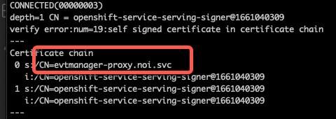
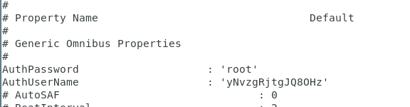
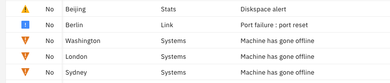

You've installed OMNIbus on the previous step. Now to configure it.


1. Configure OMNIbus. You should run all commands as root, to make things easier.

   - modify `/root/.bash_profile` to add these lines, then log out and back in to activate: 
   ```
   export OMNIHOME=/opt/IBM/tivoli/netcool/omnibus 
   export NCHOME=/opt/IBM/tivoli/netcool 
   ```

   - make sure `/opt/IBM/netcool/etc/omni.dat` has a hostname you can ping, and note the objectserver name it uses (probably NCOMS). Assuming your hostname is "omnibus", your file should look something like this (with other lines as well):
   ```
   [NCOMS] 
   { 
      Primary: omnibus 4100 
   } 
   ```

   - Create an interfaces file by running `/opt/IBM/tivoli/netcool/bin/nco_igen` which creates the file `/opt/IBM/tivoli/netcool/etc/interfaces.linux2x86`. That file should have lines like this in it: 
   ```
   # NCOMS => omnibus 4100 
   NCOMS 
   master tcp sun-ether omnibus 4100 
   query tcp sun-ether omnibus 4100  
   ```

1. Create and test an objectserver. 

   - Run `$OMNIHOME/bin/nco_dbinit` (giving no parameters will create an objectserver called NCOMS, matching the name in the above files). 

   - Run `$OMNIHOME/bin/nco_objserv` (no parms means it will start the objectserver called NCOMS). 

   - When it gives a message saying it's running, you can hit CTRL-Z, then type `bg` to put it into the background. 

   - You can run `$OMNIHOME/bin/nco_ping NCOMS` to see if it's running. 

   - Insert a message onto the server with this command: 
   ```
   $OMNIHOME/bin/nco_postmsg –user root –password '' "Identifier='91GA142'" "Severity=5" "Summary='Power Outage scheduled 4:00pm - 11:00pm today'" "Location='OAK HILL BRANCH'" "Node='91GA141'" "AlertGroup='CAPITAL METRO'" "Type=1"
   ```

      If there is no error message, then you've succeeded. 


1. Use OMNIbus to insert a message onto Event Manager in the cloud. This assumes you have access to Event Manager running on OCP. See the HOWTO on that to get started.

   - Configure a connection to cloud Event Manager (following Zane's instructions [here](https://community.ibm.com/community/user/aiops/blogs/zane-bray1/2022/04/13/getting-started-with-watson-aiops-event-manager-27?CommunityKey=2741e25c-5de0-4c9f-98d9-a0002f821ea4){:target="_blank"}). You'll need to do these steps: 

      - identify the port of the primary cloud instance

      - get the certificate of cloud instance and save it in a keystore 

      - get the IP of cloud instance, plus the service name.  NOTE: The service name doesn't appear in the ping, contrary to what Zane describes. However, you can find it with the `openssl` command which Zane tells you to run: `openssl s_client -connect <ingress-name>:<primary port>`; the output will look like this:

         

      - modify /etc/hosts with this info. ex:  
      ```
      169.62.109.106  evtmanager-proxy.noi.svc 
      ```

      - modify omni.dat. ex: 
      ```
      [ROKS_AGG_P] 
      { 
         Primary: evtmanager-proxy.noi.svc ssl 30694 
      } 
      ```

      - run `$NCHOME/bin/nco_igen` to update interfaces 

    - Test your configuration by running postmsg.

        - Get the root password from the `evtmanager-omni-secret` secret in the right namespace.

        - Run: 
        ```
        $OMNIHOME/bin/nco_postmsg -server ROKS_AGG_P -user root -password <pw-from-omni-secret> "Identifier='DC4A142'" "OwnerUID=65534" "Severity=5" "Summary='Power Outage scheduled 4:00pm - 11:00pm today'" "Location='OAK HILL BRANCH'" "Node='DC4A141'" "AlertGroup='DC4 CAPITAL METRO'" "Type=1" 
        ```

    - Look at Alert Viewer in the cloud and see the event. 


1. Create a gateway to forward messages from a local objectserver to the cloud. Do the above steps, and then continue here. 

    - Modify omni.dat: 
    ```
    [CLOUD_GATE] 
    { 
        Primary: omnibus <some unused port like 4500> 
    } 
    ```

    - Run `$NCHOME/bin/nco_igen`

    - Create a directory in `$OMNIHOME/gates` called `CLOUD_GATE`

    - Copy and rename files from the `$OMNIHOME/objserv_uni` directory to `CLOUD_GATE.*`. 

    - In the .props file, modify these values: 
    ```
    MessageLevel            : 'warn' 
    MessageLog              : '$OMNIHOME/log/CLOUD_GATE.log' 
    Name                    : 'CLOUD_GATE' 
    Gate.MapFile            : '$OMNIHOME/gates/CLOUD_GATE/CLOUD_GATE.map' 
    Gate.StartupCmdFile     : '$OMNIHOME/gates/CLOUD_GATE/CLOUD_GATE.startup.cmd' 
    Gate.Reader.Debug       : TRUE 
    Gate.Reader.Server      : 'NCOMS' 
    Gate.Reader.Username    : 'root' 
    Gate.Reader.Password    : '' 
    Gate.Writer.Debug       : TRUE	 
    ```

    - Copy the .props file to `$OMNIHOME/etc`

    - If the NCOMS objectserver is not already running, start it with:
    ```
    $OMNIHOME/bin/nco_objserv -name NCOMS
    ```

    - Start the gateway:
    ```
    $OMNIHOME/bin/nco_g_objserv_uni -name CLOUD_GATE
    ```

    - Wait a minute to confirm that the gateway is running. If it fails, then check the log file for hints. If it succeeds, you can get back to the command line by hitting CTRL-Z, then type `bg` and hit enter. 

1. Now any message inserted into the NCOMS objectserver will be forwarded to the cloud instance. Test it out by posting a message to NCOMS and see it be forwarded to the cloud: 
```
$OMNIHOME/bin/nco_postmsg -server NCOMS -user root -password "" "Identifier='DC5A142'" "OwnerUID=65534" "Severity=5" "Summary='Power Outage scheduled 4:00pm - 11:00pm today'" "Location='OAK HILL BRANCH'" "Node='DC5A141'" "AlertGroup='DC5 CAPITAL METRO'" "Type=1"  
```

Check the Alert Viewer in the cloud and see the message.

1. If you want to send a series of messages to Event Manager, you can use the `simnet` probe.

   - Edit the `./omnibus/probes/linux2x86/simnet.props` file. Remove the comments from the `AuthPassword` and `AuthUserName` entries, and provide the proper values: `root` for the user and the value from the `evtmanager-omni-secret` Secret for the password.

      

   - Run this command:
   ```
   $OMNIHOME/probes/nco_p_simnet -server ROKS_AGG_P
   ```

      If it's working correctly, you will not see any message on the console. Go to the Alert Viewer and you should see various random messages appear. Click the Refresh icon to get quicker updates.

      


   - The simnet probe will run until you hit CTRL-C to stop it.

 

 

 