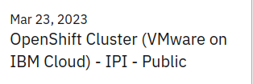

These instructions will show you how to create an Event Manager instance on OCP on the IBM Cloud.

1. Create an OpenShift instance using techzone.

    - Go to [https://techzone.ibm.com/collection/tech-zone-certified-base-images](https://techzone.ibm.com/collection/tech-zone-certified-base-images){:target="_blank"}. 

    - Click the **Reserve** button for OpenShift cluster (VMWare on IBM Cloud) - IPI - Public.

        
     
    - Fill out the form according to your needs. 
        - Pick an even number OCP version (ex. 4.10 or 4.12, _not_ 4.11).
        - Make sure to select **5 Worker Nodes**. 
        - For OCS/ODF size, choose **2 TiB**.
        - For the Worker Node Flavor, choose **(32 vCPU x 128GB – 300 GB Secondary Storage)**.

    - Click **Submit** and wait for it to be provisioned. 

    When it has provisioned, the ID and password for OCP are on the details page of the Techzone reservation. Install Event Manager as described below. 
     

1. Install Event Manager. 

    - You can use Zane Bray's step-by-step method [here](https://community.ibm.com/community/user/aiops/blogs/zane-bray1/2022/04/01/getting-started-with-watson-aiops-event-manager-17?CommunityKey=2741e25c-5de0-4c9f-98d9-a0002f821ea4){:target="_blank"}, or use Nik Hurt's super easy installation process [here](https://github.com/niklaushirt/cp4waiops-deployer){:target="_blank"} (Scroll down to "Install Event Manager with demo content").  Either method will get you what you need. You may want to go through Zane's instructions at least once just to see what it takes, and then next time use Nik's method. 

    - If you use Nik's method, go through the steps in Zane's method to use WebGUI to give the icpadmin user more authorization if you want to do some of the other HOWTOs in this guide. 
     
1. Access the Event Manager UI.

    - The URL for the user interface can be found by looking for the Route called **evtmanager-ibm-hdm-common-ui** in the correct project. The ID is `icpadmin` and the password can be found in the secret called `evtmanager-icpadmin-secret`.

That's it! 
 

 