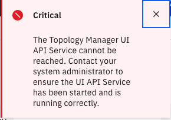

You may want to empty the topology database for whatever reason. Follow these steps. You will need the `oc` application installed on your system.

> NOTE: This procedure only works for the topology database which comes with Event Manager.

1. Log on to OCP from the command line.

   - From the OCP console, click on your name, then on **Copy login command**.

      

   - Click **Display Token** and then copy the `oc login` command.

   - Open a Terminal window and paste that command. You'll see a message about how many projects you can access.

1. Run the job to delete the topology information.

   - Change to the correct namespace with the command `oc project cp4waiops-evtmgr` if you used Nik's method to install, or `oc project noi` if you used Zane's method.

   - Download [this file](../files/delete-all-topology.sh) to your system and run it from that same Terminal window. You'll see several harmless NotFound messages; that just means that the observer it is looking for is not installed.

   - The job will take a couple minutes to run. When it's done, you'll be returned to the command line.

      

   - Wait a few minutes for the Topology system to be fully restarted. If you go to the list of observer jobs and see a message like the following, you'll know it's not ready.

      

   - When you refresh the page and don't see the error message, you know that the system is ready.