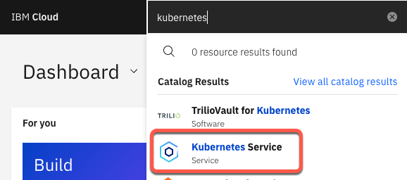
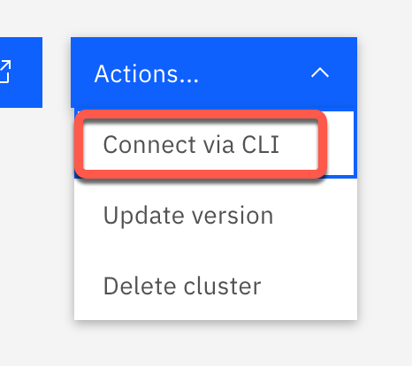

 To follow these instructions, you'll need to have kubectl and the IBM Cloud CLI (ibmcloud) installed on your system. You will also need an Event Manager (NOI) instance installed on OCP. 

1. Create a Kubernetes instance in IBM Cloud. 

   - Go to [https://cloud.ibm.com](https://cloud.ibm.com){:target="_blank"}. 

   - In the search bar at the top, type kubernetes and wait for the results to load. Choose Kubernetes Service. 

      

   - Select the Free version. Fill out the rest of the form as appropriate, and submit. 

1. Install the bookinfo application. 

   You can find details about this application here: [https://istio.io/latest/docs/examples/bookinfo/](https://istio.io/latest/docs/examples/bookinfo/){:target="_blank"}. This includes a good architecture image.  

   - When your Kubernetes instance has provisioned, select it from your list of resources from IBM Cloud here: [https://cloud.ibm.com/resources](https://cloud.ibm.com/resources){:target="_blank"}. 

   - Click on Actions in the top right, and choose Connect via CLI. 

      


   - Follow the instructions in the dialog which opens.  

      - Log in to IBM Cloud from a terminal on your Mac using ibmcloud login --sso.  

      - Log in to the cluster with the ID of your cluster; it will something like `ibmcloud ks cluster config --cluster cb7hv4uf0t8n3atne8t0`.  

   - Download the yaml file here: [https://raw.githubusercontent.com/istio/istio/master/samples/bookinfo/platform/kube/bookinfo.yaml](https://raw.githubusercontent.com/istio/istio/master/samples/bookinfo/platform/kube/bookinfo.yaml){:target="_blank"}. 

   - From the same terminal window, type these instructions: 
   ```
   kubectl create namespace bookinfo ; kubectl -n bookinfo apply -f <bookinfo.yaml file you just downloaded>
   ``

   - You can confirm it's up and running when you run `kubectl -n bookinfo get pods` and they are all Running. 

   - If you want to run the application, follow these steps: 

      - Type `kubectl –n bookinfo get service productpage` and note the port. It should show something like `9080:30080/TCP`. You care about the `30080`. 

   - Back on the cluster page in IBM Cloud, click on the Worker nodes tab on the left. Note the Public IP address. 

   - Open a browser window to http://&lt;public ip&gt;:&lt;port&gt;. Example: http://169.51.203.66:30080.  


1. Define a Kubernetes load job in Topology Manager on OCP. 

   - Follow instructions "To define Kubernetes load jobs" here: [https://www.ibm.com/docs/en/nasm/1.1.14?topic=manually-defining-kubernetes-observer-jobs](https://www.ibm.com/docs/en/nasm/1.1.14?topic=manually-defining-kubernetes-observer-jobs){:target="_blank"}. Note that the yaml file is not configured correctly on this page; the indentation is wrong. 

   -  Use the **clusterrole** yaml, not the role yaml, but (as I said above) it's wrong so you'll need to edit it. You can see that the "kind" statement is on the far left and everything else is indented, which is incorrect. The correct format is this: 

      


   - Save this as a file to your computer and apply it with this command: 
   ```
   kubectl apply –f <name of clusterrole file>
   ```

   - Skip the part about custom resource definitions; bookinfo doesn't have any. 

   - Get the service account token and save it. For some unknown reason, the instructions on this page changed from using `kubectl` to using `oc`. Either command works.

   - Skip the part about editing the `kubernetes_observer_common.sh` file. 
   
      You're now done with this page. 


1. Configure a topology load job. 

   - Access Event Manager by figuring out the URL. The pattern is: 
https://netcool-&lt;deployment-name&gt;.&lt;ingress-subdomain&gt;. (You can also get there by looking for the Route called **evtmanager-ibm-hdm-common-ui** in the correct project.)
The deployment name using either method (Zane's or Nik's) is evtmanager. The ingress subdomain is available from the cluster information page in IBM Cloud.   

   - The Username is icpadmin. 

   - The Password is found in the Secret called `evtmanager-icpadmin-secret` in the appropriate namespace (for Zane's instructions, it's `noi`, and with Nik's method it's `cp4waiops-evtmgr`). 

   - Follow Zane's instructions to grant the icpadmin user enhanced authority; without it, you can't administrate the topology. 

   - From the NOI landing page, click on the menu in the top left, then **Administration -> Topology configuration**. 

   - Click on **Observer jobs**, then click **Add a new job**. 

   - Choose the Kubernetes tile and fill in the form: 

      Field | Value
      ---|---
      Job type | load
      Unique id | Load bookinfo
      Data_center | IBMCLOUD
      Kubernetes Master IP address | The host name of the cluster. You can get it from the cluster page on IBM Cloud. Look for the Public Service endpoint URL under Networking. It will be something like https://c107.eu-de.containers.cloud.ibm.com:31052; just use the hostname part.
      Kubernetes API port | The port from the above URL.
      Kubernetes token | The service account token you saved above.
      Trust all certificates | true

   - Open the **Additional parameters** section and use `bookinfo` for the **Namespace** value.

   - Click **Save** and you'll be returned to the previous page. The job will run for a few seconds. When it completes, it will go back to Ready state. Click on the ellipsis and choose View history to see if it succeeded. 

   If it failed, check your job settings and make corrections as necessary. You may need to create a new job if you need to change an uneditable setting. 

1. View the topology.
   
   - From the menu at the top right, choose **Resource management**. 

   - You should be in the **Resource groups** tab, and see the `bookinfo:IBMCLOUD` group in the list. 
   
   - Click it and you'll see everything which the Topology component found.

      


That's it! 
 