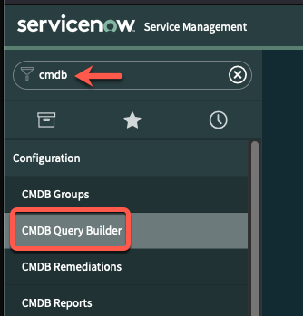
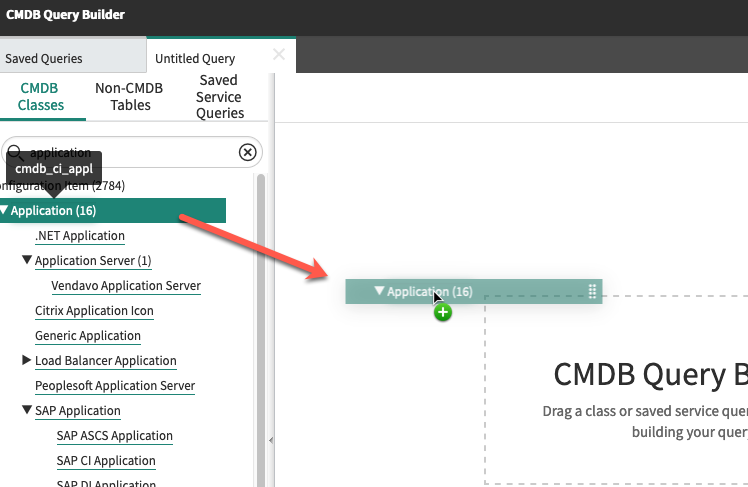
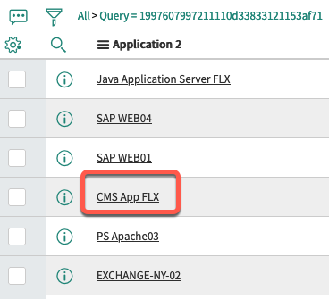
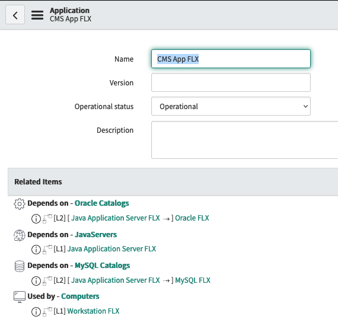
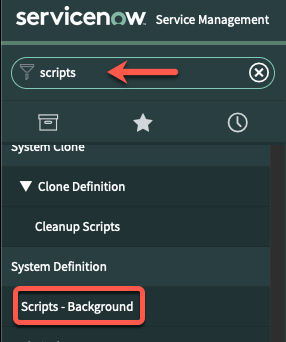
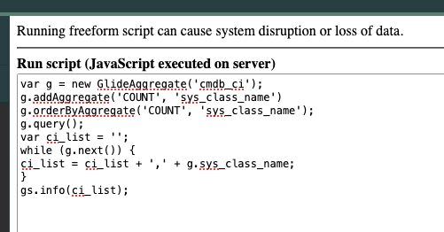
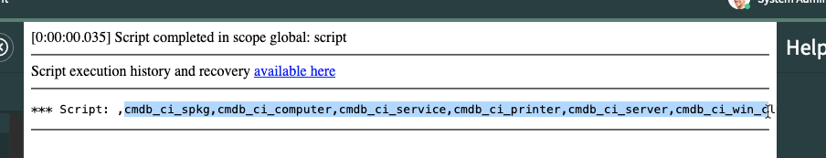
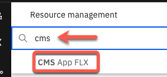
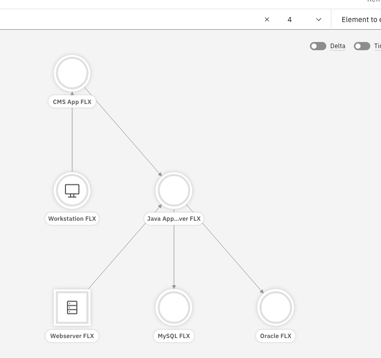

 To follow these instructions, you will need an Event Manager instance installed on OCP; it comes with the Topology component. You can find help setting this up from the menu on the left.

1. Create a developer ServiceNow account.

   - Go to [https://developer.servicenow.com](https://developer.servicenow.com){:target="_blank"} and create an account. 

   - Log in and request an instance. At the time of this writing, our solution officially supports only the New York, Quebec, and Paris releases; check [the documentation](https://www.ibm.com/docs/en/nasm/1.1.14?topic=ui-configuring-servicenow-observer-jobs){:target="_blank"} for the supported releases. For this HOWTO, I'm using the Quebec release, although it worked for me on the San Diego release as well (the ServiceNow navigation is slightly different than below). The instance should start very quickly.  Take note of the URL, ID, and password; you'll need them later. The instance has a CMDB which will be populated with sample data, which is exactly what we want.

   > NOTE: The ServiceNow instance will hibernate after a while if you don't use it. You'll need to log in to the developer web site again to restore it, and this can take over an hour. If it's stuck, release it and request another. Be sure to plan ahead if you are planning on demonstrating this feature. The instance will be deleted if it's untouched for 10 days; if that happens, just create another.

   - Click **Open Instance**. In the left sidebar, search for **cmdb** and select **CMDB Query Builder**.

      

   - In the window which opens, select **Create new** and then **Create** in the Create New Query dialog.

   - In the list on the left sidebar, search for **application** and drag-drop the application item to the canvas in the center.

      

   - Click the **Run** button at the top right. A new window will open with the results of the search. Click **CMS App Flex** from the list.

      

   - You'll see the CMS App Flx application, along with the related items. Note the "Depends on" and "Used by" relationships, as you'll see them in the Topology Viewer in WAIOps.

      

1. Create a Topology observer job.

   - Return to the ServiceNow home page and type **scripts** into the search. Select the **System Definition -> Scripts - Background** option. You will need to run a script to find out which Configuration Items (also called CIs) are in use in this instance of ServiceNow. You can choose to select a subset of the active CIs, but if you include CIs which *are not* in use by ServiceNow, the observer will not work correctly and you won't see any relationships between the entities.

      

   - In the **Run script** box, paste in this script:
      ```
      var g = new GlideAggregate('cmdb_ci');
      g.addAggregate('COUNT', 'sys_class_name')
      g.orderByAggregate('COUNT', 'sys_class_name');
      g.query();
      var ci_list = '';
      while (g.next()) {
      ci_list = ci_list + ',' + g.sys_class_name;
      }
      gs.info(ci_list);
      ```

      It will look like this:

      

      >Note: this script is a modified version of what you can find in the IBM documentation [here](https://www.ibm.com/docs/en/nasm/1.1.10?topic=ui-configuring-servicenow-observer-jobs){:target="_blank"}. It will print out all the CIs which are used in this instance in a format which can be pasted directly into the appropriate job field below.

   - Click the **Run script** button. The results will display in the page; copy the list (minus the first comma) and save for use below. NOTE: remove `cmdb_ci` from the list, as it's not allowed by the observer and will cause an error.

      

   - From the NOI menu, choose **Administration -> Topology configuration** (If you don't see that option, you will need to give your icpadmin user enhanced permissions in order to see it. Look at [Zane's blog](https://community.ibm.com/community/user/aiops/blogs/zane-bray1/2022/04/01/getting-started-with-watson-aiops-event-manager-17?CommunityKey=2741e25c-5de0-4c9f-98d9-a0002f821ea4){:target="_blank"} for instructions).

   - Select **Observer jobs** then **Add a new job**. Select the ServiceNow tile. 
   
   - Fill out the instance URL, username, and password with the values you saved above. 

   - Open the **Additional parameters** section. 

      - For **Default ServiceNow tables**, use `cmdb_ci`.

      - For **CI types to be discovered**, use the list you saved above (without `cmdb_ci`, as noted above).

   - Click **Save**.  The job will run for a few minutes. When it's done, check the history to confirm that it finished without errors.

1. View the topology.

   - Click **Resource management** from the menu at the top left. The Resources tab should show 2783 resources (more if you have other observers).

   - Switch to the Resources tab and type **cms** the search field; wait for the system to find the one result. Click on **CMS App Flx**.

      

   - Change the number of relationships to **4** in the tool bar, and then click the **Render** button. You should see the same relationships which you found in ServiceNow.

      

   - Click on the different elements and see the relationships displayed as they are in ServiceNow.
 