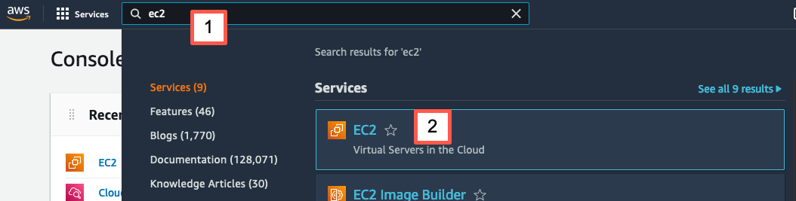
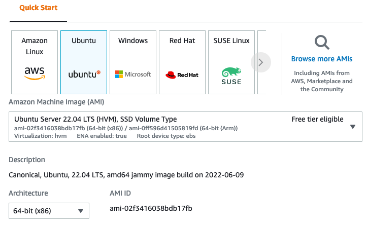
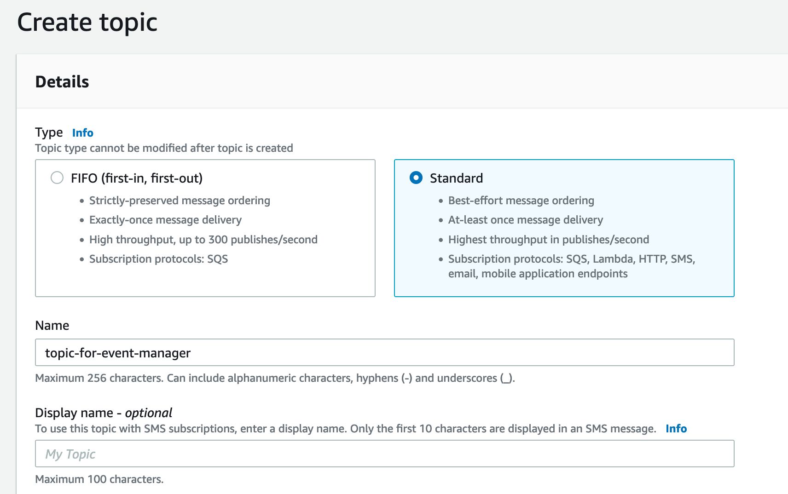
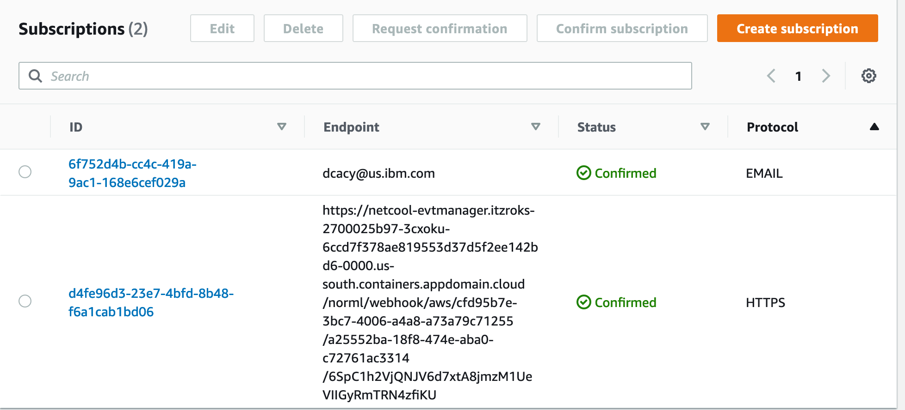
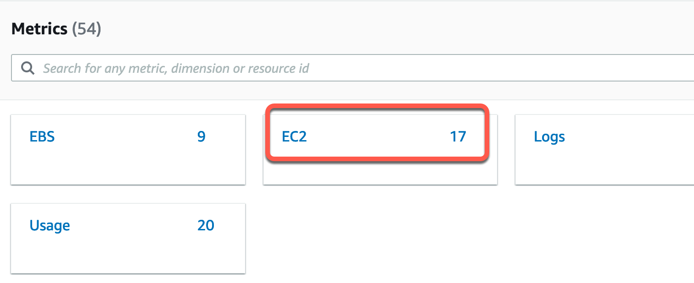
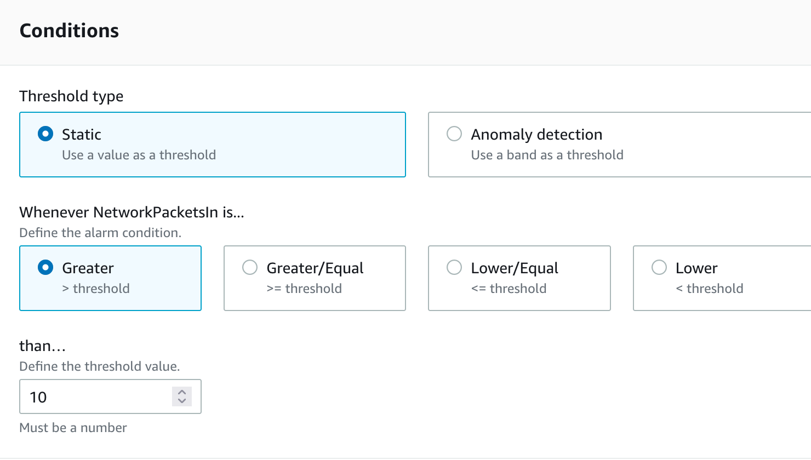
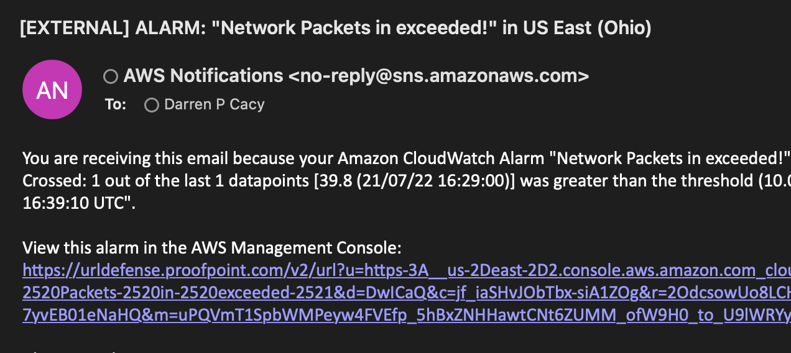

This HOWTO will walk through the steps to create an EC2 instance on AWS, configure alarms on AWS, and forward those alarms to Event Manager.  

1. Create a free EC2 instance on AWS. If you already have an instance on EC2, then you can skip this step. 

   - Create an AWS account at [https://aws.amazon.com](https://aws.amazon.com){:target="_blank"} and log in. Search for EC2 and select it: 

      
     

   - Click the Launch Instance button. 
     

   - Fill out the form which opens. I chose the free version of Ubuntu; you can select whatever you want, of course.

      

   - Launch the instance.
     

1. Now to create an alarm. This will require you to create a Topic and Subscriptions in the Simple Notification Service, and then an Alarm in Cloudwatch. 
 

   - Create a Topic. 

      - Search for Simple Notification Service. 

      - From the left sidebar, choose **Topics**. On the next page, click **Create topic**. 

      - Choose the **Standard** type, and give it a name. 

         

      - Click **Create topic**. 

   - Now you should be on the details page for the topic you created. Click the **Create subscription button**. 

      - On the form which opens, choose **HTTPS** for the Protocol. 

      - To get the URL for the Endpoint, you need to go to your AiOps Event Manager system. From the menu icon in the top left, choose **Administration -> Integration with other systems**. 

      - Click on **New integration**.

      - Choose the **Amazon Web Services** tile. Give the integration a name, and click on the **Copy** link for the URL before you click Save...you won't be able to get the URL after you save it. If that happens, just edit it and regenerate the URL. 

   - Go back to AWS and paste in the URL you copied into the Endpoint field. Click **Create subscription**.

   - Go back to the details page for the topic, and create another subscription. Make the protocol for this one Email, and put your email address for the Endpoint. That way you'll get an email whenever an alarm is triggered, so you know it's working. 

   - You'll get an email with a link to confirm your subscription. Click the link, and now your subscriptions should look something like this: 

      

      If the status of each is not Confirmed, then review these instructions and make changes. 

1. Create an Alarm. 

   - Search for Cloudwatch and select it. 

   - On the left sidebar, choose **All Alarms** under Alarms. Click the **Create alarm** button. Click **Select metric**. You should see a list of metric categories in tiles. Choose the **EC2** tile. 

      

   - Choose **Per-instance Metrics**, then **NetworkPacketsIn**. In the popup, choose **Add to graph**. You should see a graph appear at the top. You can only have one metric here, so if you chose the wrong one, then choose **NetworkPacketsIn** and choose **Graph this metric only** from the popup. 

   - Click **Select metric**. 

   - Scroll down to Conditions, and create a threshold condition you are sure to meet. For example, greater than 10. 

      

   - Click **Next**. 

   - In the form which opens, click **Send a notification to...** and choose the topic you created above. You should see some details (such as your email address) which confirm this is the right topic. Scroll to the bottom and click **Next**. 

   - Give the alarm a name. This will be the name which appears in the Alert Viewer in Event Manager. Click **Next**. 

   - Review the summary and click **Create alarm**. 

1. Test the alarm. 

   - Use FileZilla or some other file transfer app, and copy a large file to your EC2 instance. This should trigger the alarm, resulting in an email and an entry in the Alert Viewer. Here is what the email looks like:

      

Depending on the threshold you created, you may get an alarm without sending any data. 

> NOTE: In order to keep all your configuration but to stop receiving messages, you can change the alert threshold to something very high (like 10000). That way you'll have everything ready in case you want to show how to configure it, or to demonstrate this functionality. 

You're done! 