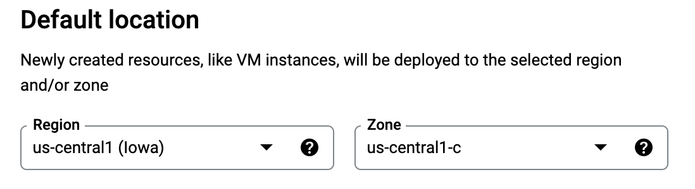
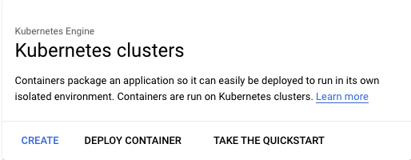
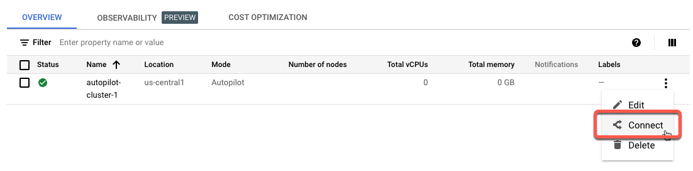
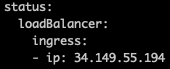
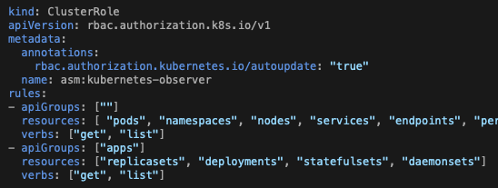
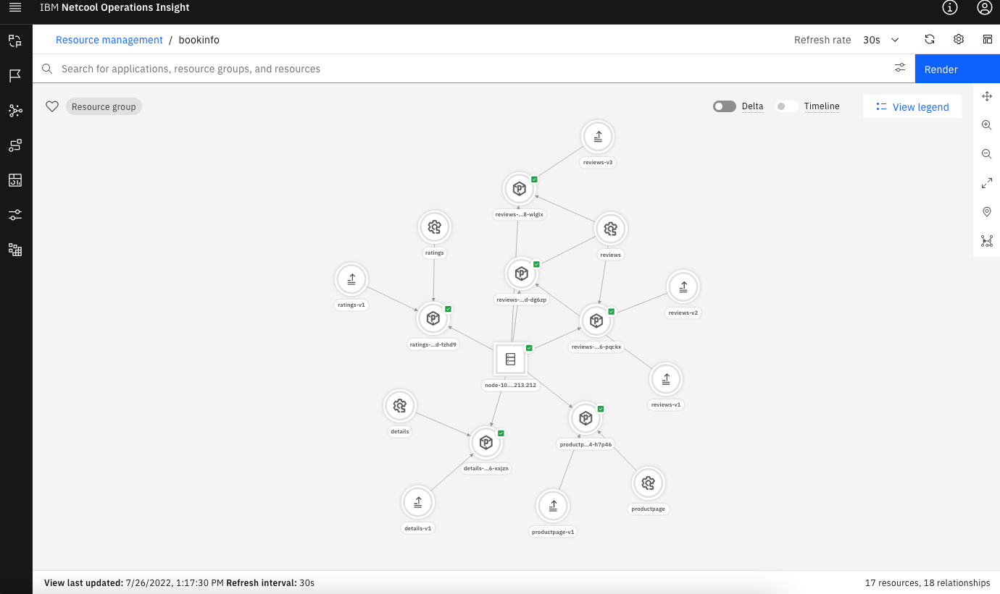

 To follow these instructions, you'll need to have kubectl and the Google Cloud CLI (gcloud) installed on your system. You will also need an Event Manager (NOI) instance installed on OCP. I have instructions below on installing gcloud; find instructions on installing Event Manager elsewhere on this site.

1. Create a Kubernetes cluster in Google Cloud. 

   - Create a Google Cloud account at [https://cloud.google.com](https://cloud.google.com){:target="_blank"}. It should create a project for you.

   - Change the default Region and Zone for your project. 

      - Go to [https://console.cloud.google.com/compute/settings](https://console.cloud.google.com/compute/settings){:target="_blank"}. Set the Region and Zone as you choose. Here is my example.

         

   - Go to [https://cloud.google.com/kubernetes-engine](https://cloud.google.com/kubernetes-engine){:target="_blank"}. If you've never done this before, click the **Try GKE free** button, where you create an account and provide a credit card number. We will be using the free kubernetes cluster, but they do want that info to get started.

   - Google will create a project for you called **My First Project**, and you should be on the Kubernetes API page. Click the **Enable** button to enable the Kubernetes API; you must do that in order to create a cluster (this wasn't intuitive to me).

   - Click the **Create** button to create a cluster.

      

   - In the window which opens, choose **GKE Autopilot**.

   > NOTE: The GKE Autopilot cluster will be free.  If you choose GKE Standard, you may be charged.

   - Leave the defaults and click the **CREATE** button.

   - The cluster will begin to be created.

1. Install the Google CLI (gcloud).

   - While the cluster is being created, install the command line tool you'll need in order to configure it.

   - From a terminal, run this command:
   ```
   curl https://sdk.cloud.google.com | bash
   ```
   Accept the defaults. Then run this command to restart your shell:
   ```
   exec -l $SHELL
   ```

   - Log in to your Google account from gcloud with `gcloud auth login`. 

1. Install the bookinfo application. 

   You can find details about this application here: [https://istio.io/latest/docs/examples/bookinfo/](https://istio.io/latest/docs/examples/bookinfo/){:target="_blank"}. This includes a good architecture image.  

   - When your Kubernetes instance has provisioned, click on the vertical ellipsis on the right and choose **Connect**.

      

   - Copy the **Command line access** command and paste it into the terminal. It will look something like this:
   ```
   gcloud container clusters get-credentials autopilot-cluster-1 --region us-central1 --project secure-garden-357820
   ```

   - You are now ready to run `kubectl` commands against this cluster. Download the yaml file here: [https://raw.githubusercontent.com/istio/istio/master/samples/bookinfo/platform/kube/bookinfo.yaml](https://raw.githubusercontent.com/istio/istio/master/samples/bookinfo/platform/kube/bookinfo.yaml){:target="_blank"}. 

   - From the same terminal window, type these instructions: 
   ```
   kubectl create namespace bookinfo ; kubectl -n bookinfo apply -f <bookinfo.yaml file you just downloaded>
   ```

   - You can confirm the installation is complete when you run `kubectl -n bookinfo get pods` and they are all Running. 

   - If you want to run the application, follow these steps: 

      - Type the following in the terminal:
      <pre><code>
      cat <<EOF | kubectl -n bookinfo apply -f -
      apiVersion: networking.k8s.io/v1
      kind: Ingress
      metadata:
      name: bookinfo-ingress
      annotations:
        # If the class annotation is not specified it defaults to "gce".
        kubernetes.io/ingress.class: "gce"
      spec:
      rules:
      - http:
          paths:
          - path: /*
            pathType: ImplementationSpecific
            backend:
              service:
                name: productpage
                port:
                number: 9080
      EOF
      </code></pre>

   - The above command creates an ingress, which creates a way for external systems to access an application running in a kubernetes cluster. It takes several minutes for this process to complete; you'll know that it is done when you run this command and see an IP address at the bottom of the output:
   ```
   kubectl -n bookinfo get ingress bookinfo-ingress --output yaml
   ```

   The successful output will look like this:

      

   - Copy that IP address into a browser and you should see the bookinfo start page. 


1. Define a Kubernetes load job in Topology Manager on OCP. 

   - Follow instructions "To define Kubernetes load jobs" here: [https://www.ibm.com/docs/en/nasm/1.1.14?topic=manually-defining-kubernetes-observer-jobs](https://www.ibm.com/docs/en/nasm/1.1.14?topic=manually-defining-kubernetes-observer-jobs){:target="_blank"}. Note that the yaml file is not configured correctly on this page; the indentation is wrong. 

   -  Use the **clusterrole** yaml, not the role yaml, but (as I said above) it's wrong so you'll need to edit it. You can see that the "kind" statement is on the far left and everything else is indented, which is incorrect. The correct format is this: 

      


   - Save this as a file to your computer and apply it with this command: 
   ```
   kubectl apply –f <name of clusterrole file>
   ```

   - Skip the part about custom resource definitions; bookinfo doesn't have any. 

   - Get the service account token and save it. For some unknown reason, the instructions on this page changed from using `kubectl` to using `oc`. They both work.

   - Skip the part about editing the `kubernetes_observer_common.sh` file. 
   
      You're now done with this page. 


1. Configure a topology load job. 

   - Access Event Manager by figuring out the URL. The pattern is: 
https://netcool-&lt;deployment-name&gt;.&lt;ingress-subdomain&gt;.
The deployment name using either method (Zane's or Nik's) is evtmanager. The ingress subdomain is available from the cluster information page in IBM Cloud. (You can also get there by looking for the Route called **evtmanager-ibm-hdm-common-ui** in the correct project.)

   - The Username is icpadmin. 

   - The Password is found in the Secret called `evtmanager-icpadmin-secret1` in the appropriate namespace (for Zane's instructions, it's `noi`, and with Nik's method it's `cp4waiops-evtmgr`). 

   - Follow Zane's instructions to grant the icpadmin user enhanced authority; without it, you can't administrate the topology. 

   - From the NOI landing page, click on the menu in the top left, then **Administration -> Topology configuration**. 

   - Click on **Observer jobs**, then click **Add a new job**. 

   - Choose the Kubernetes tile and fill in the form: 

      Field | Value
      ---|---
      Job type | load
      Unique id | Load bookinfo
      Data_center | IBMCLOUD
      Kubernetes Master IP address | The IP address of the cluster. You can get it by running `kubectl cluster-info` and noting the IP address of the Kubernetes control plane.
      Kubernetes API port | 443
      Kubernetes token | The service account token you saved above.
      Trust all certificates | true

   - Open the **Additional parameters** section and use `bookinfo` for the **Namespace** value.

   - Click **Save** and you'll be returned to the previous page. The job will run for a few seconds. When it completes, it will go back to Ready state. Click on the ellipsis and choose View history to see if it succeeded. 

   If it failed, check your job settings and make corrections as necessary. You may need to create a new job if you need to change an uneditable setting. 

1. View the topology.
   
   - From the menu at the top right, choose **Resource management**. 

   - You should be in the **Resource groups** tab, and see the `bookinfo:GKE` group in the list. 
   
   - Click it and you'll see everything which the WAIOps topology component found.

      


That's it! 
 