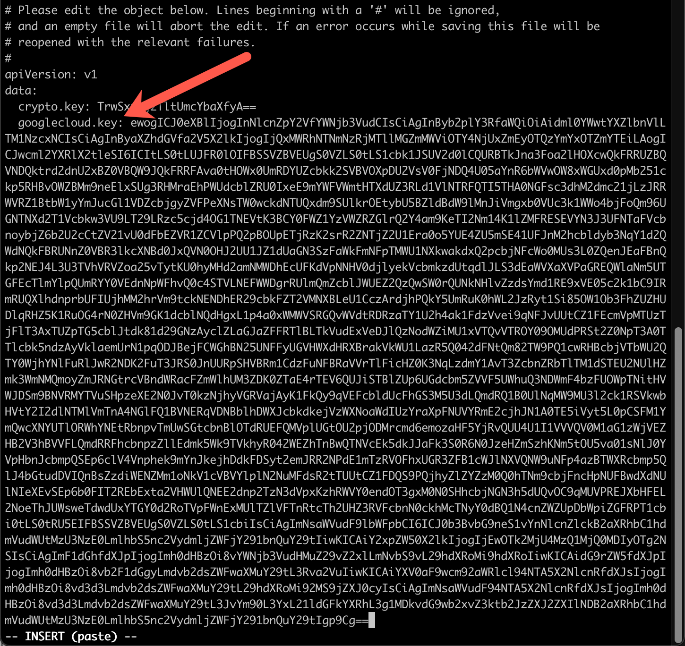
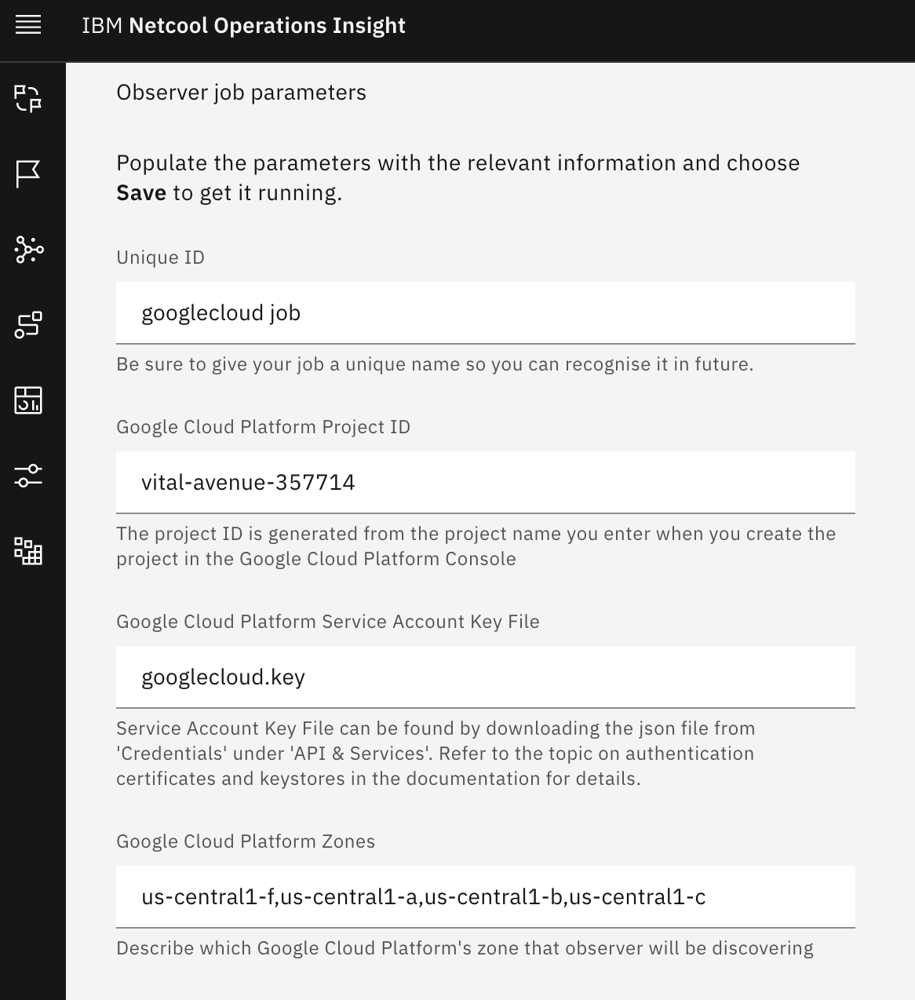

 To follow these instructions, you'll need to have kubectl and the Google Cloud CLI (gcloud) installed on your system. You will also need an Event Manager (NOI) instance installed on OCP. I have instructions below on installing gcloud; find instructions on installing Event Manager elsewhere on this site.

1. Create a Kubernetes cluster in Google Cloud, following the instructions in the "HOWTO Import Kubernetes Topology from GKE" page elsewhere on this site.

1. Define a GoogleCloud load job in Topology Manager on OCP. 

   - Follow instructions on "Defining Google Cloud Observer jobs" here: [https://www.ibm.com/docs/en/nasm/1.1.14?topic=manually-defining-googlecloud-observer-jobs](https://www.ibm.com/docs/en/nasm/1.1.14?
   topic=manually-defining-googlecloud-observer-jobs){:target="_blank"}. Here are some tips, as the page navigation has changed from when our documentation was written :

      - To find the dashboard for your project, log on to [https://cloud.google.com](https://cloud.google.com){:target="_blank"} and click on the Google Cloud link in the banner, then on the **Dashboard** link for your project.

      - Click **+ CREATE CREDENTIALS** at the top, then choose **Service account**.

      - Click **Create**.  For the Role, type `compute admin` in the filter text field, then choose **Compute Admin**.

      - The base64 command provided in the instructions is for Linux. For the Mac, you can leave off the `-w` command, and do this: `cat {your-json-file} | base64 > googlecloud.json`. 

      - The secret in OCP is called `evtmanager-topology-custom-secrets`. The instructions in our documentation leave out the namespace; the proper command will be like this: `oc -n cp4waiops-evtmgr edit evtmanager-topology-secrets`.

      - The above command puts you into a `vi` editor. Add a new value under the **data** attribute, pasting in the contents of the googlecloud.json file above. In vi, you hit the `i` key to put yourself into edit model. If you do it right, it should look something like this:

         

      - To save the secret, hit the escape key, then type `:wq` (for "write and quit") and hit enter. You should be back on the command line. If you get an error, type `:q!` to quit without saving, then review the instructions and try again.

      The instructions in the IBM documentation show how to run a job from the command line, but we'll use the browser, so you are now done with this page.

1. Configure a topology load job. 

   - Access Event Manager by figuring out the URL. The pattern is: 
https://netcool-&lt;deployment-name&gt;.&lt;ingress-subdomain&gt;.
The deployment name using either method (Zane's or Nik's) is evtmanager. The ingress subdomain is available from the cluster information page in IBM Cloud. (You can also get there by looking for the Route called **evtmanager-ibm-hdm-common-ui** in the correct project.)

   - The Username is icpadmin. 

   - The Password is found in the Secret called `evtmanager-icpadmin-secret1` in the appropriate namespace (for Zane's instructions, it's `noi`, and with Nik's method it's `cp4waiops-evtmgr`). 

   - Follow Zane's instructions to grant the icpadmin user enhanced authority; without it, you can't administrate the topology. 

   - From the NOI landing page, click on the menu in the top left, then **Administration -> Topology configuration**. 

   - Click on **Observer jobs**, then click **Add a new job**. 

   - If there is no Google Cloud tile, follow these instructions to enable it.

      - In the OCP console, go to Operators -> Installed Operators, and make sure you are in the correct project.

      - Click on the Cloud Pak operator, then the NOI tab. Choose the NOI entry, then click on YAML tab.

      - Find "googlecloud" under observers and set it to true. (Hint: click once on the yaml file, then hit CMD-F to bring up the search bar.)

      - Click **Save**.  The NOI entry will show as "reconciling" - when its status is OK, go back to list of observers and Google Cloud will be there.

   - Choose the Google Cloud tile and fill in the form: 

      Field | Value
      ---|---
      Unique ID | googlecloud job
      Google Cloud Platform Project ID | The ID of your project from its dashboard. NOTE: It's not the same as the name of the project.
      Google Cloud Platform Service Account Key Fille | the name you provided in the secrets file. In my example, it's `googlecloud.key`.
      Google Cloud Platform zones | The zones of your k8s cluster. You can find the zones with this command: `gcloud container clusters describe <cluster name> --region <location of the cluster found in the dashboard> --project <your project name>`

   - Your page should look something like this:

      

   - Click **Save** and you'll be returned to the previous page. The job will run for a few seconds. When it completes, it will go back to Ready state. Click on the ellipsis and choose View history to see if it succeeded. 

   If it failed, check your job settings and make corrections as necessary. You may need to create a new job if you need to change an uneditable setting. 

1. View the topology.
   
   - From the menu at the top right, choose **Resource management**. 

   - You should be in the **Resource groups** tab, and see the `bookinfo:GKE` group in the list. 
   
   - Click it and you'll see everything which the WAIOps topology component found.

      

That's it! 
 