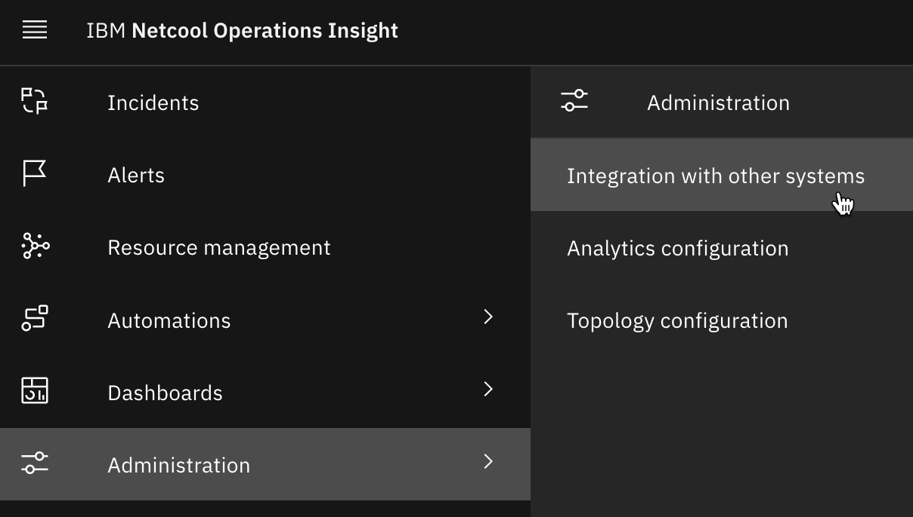
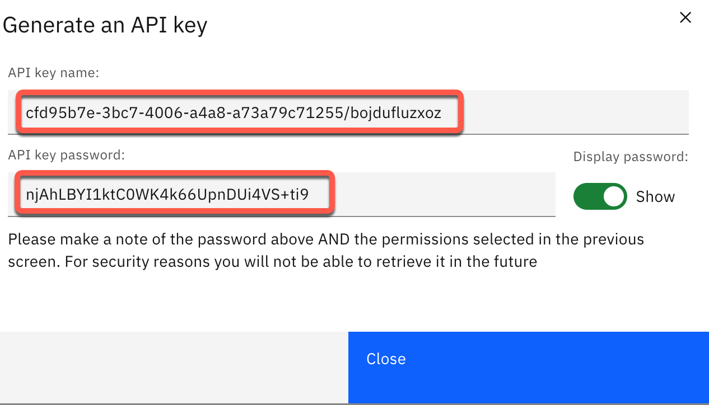
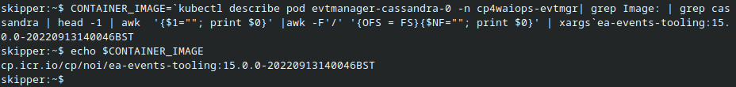
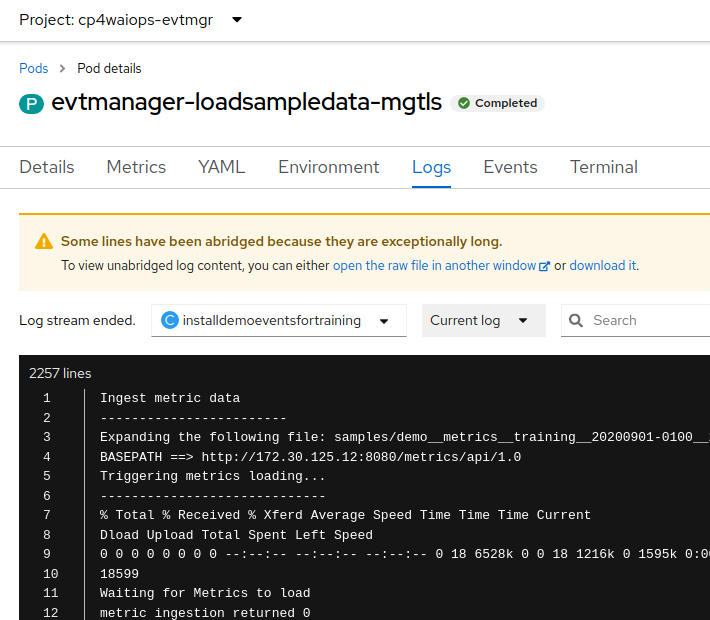
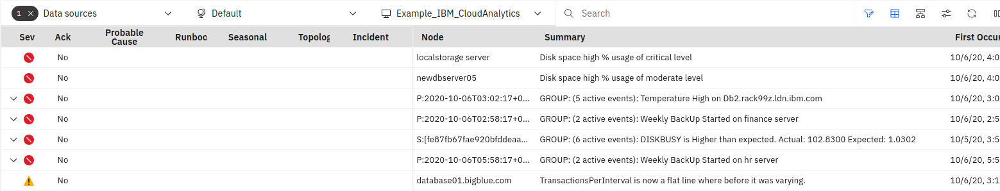
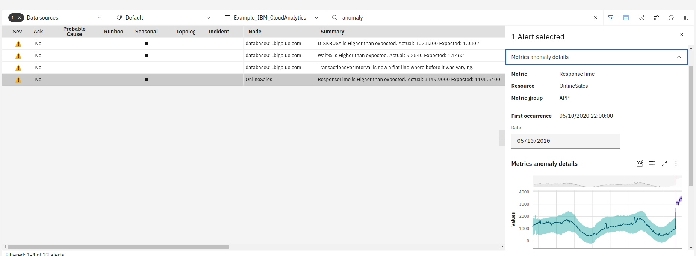
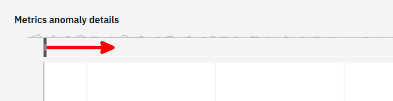
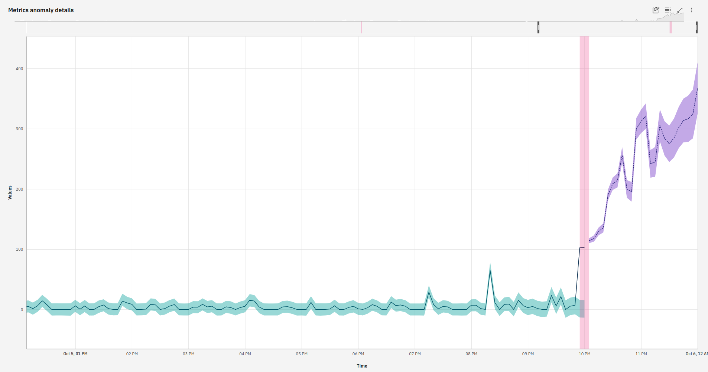

 To follow these instructions, you will need an Event Manager instance installed on OCP; it comes with the Metric component. You can find help setting this up from the menu on the left. You will need both `oc` and `kubectl` installed.

 The implementation of Metric Anomaly Detection (MAD) for Event Manager is focused on metrics tied to events, and it can also detect standalone anonmalies. This howto will show the former.

If you make a mistake and want to start over, you can delete the metrics by following the [HOWTO Completely Delete All Metric Entries](../../08-howto-completely-delete-all-metric-entries-evtmgr) guide on this site. You'll have to delete each Alert manually, however.

>NOTE: These instructions are taken from the documentation on using the built-in sample data [here](https://www.ibm.com/docs/en/noi/1.6.8?topic=analytics-scenario-sample-data){:target="_blank"}. At the time of this writing, those instructions are incomplete and/or incorrect, so follow this guide.

1. Create an API key.

   -  Log on to Event Manager. The URL can be found in the route called `evtmanager-ibm-hdm-common-ui` in the appropriate project. The ID is `icpadmin` and the password can be found in the secret called `evtmanager-icpadmin-secret`.

   - From the menu at the left, choose **Administration -> Integration with other systems**.

      

   - Change to the **API keys** tab and click the **Generate API key** button. 

   - Give it a description, make sure the **Metrics Ingestion API** box is checked, and click the **Generate** button.

   - Save the <u>key name AND the password</u> for later use. This is the last time the password will display so if you did't save it, make another key -- and save it this time. :-)

      

1. Log on to OCP from the command line.

   - From the OCP console, click on your name, then on **Copy login command**.

      

   - Click **Display Token** and then copy the `oc login` command.

   - Open a Terminal window and paste that command. You'll see a message about how many projects you can access.

   - Change to the Event Manager namespace with `oc project <namespace>` (with Zane's instructions, it's `noi`, and with Nik's method it's `cp4waiops-evtmgr`).

1. Get the image and image tag of the **ea-events-tooling** container.

   - Log in to your OpenShift cluster from the command line using `oc` and run this command:
   
      ```
      kubectl get noi evtmanager -o yaml | grep ea-events-tooling
      ```
      where **evtmanager** is the name of your release.

      The output will look something like this: 

      ```
      --env=CONTAINER_IMAGE=`kubectl describe pod evtmanager-cassandra-0 -n cp4waiops-evtmgr| grep Image: | grep cassandra | head -1 | awk  '{$1=""; print $0}' |awk -F'/' '{OFS = FS}{$NF=""; print $0}' | xargs`ea-events-tooling:15.0.0-20220913140046BST \
      --image=`kubectl describe pod evtmanager-cassandra-0 -n cp4waiops-evtmgr| grep Image: | grep cassandra |  head -1 | awk  '{$1=""; print $0}' |awk -F'/' '{OFS = FS}{$NF=""; print $0}' | xargs`ea-events-tooling:15.0.0-20220913140046BST \
      ```

   - Copy the first line, which starts with **--env** and ends with **\\**. Copy everything _between_ these two values, then paste it to the command line and hit Enter. The result will be an environment variable called **CONTAINER_IMAGE**. Echoing it to the console will look something like this:

      

   You will use this environment variable in the following steps.

1. Create a yaml file which will load the data.

   - Run this command, substituting your values for the metric API key name and password:

      ```
      kubectl run loadsampledata  --restart=Never \
      --env=LICENSE=accept --image-pull-policy=Always  \
      --env=CONTAINER_IMAGE=$CONTAINER_IMAGE  \
      -i --image=$CONTAINER_IMAGE \
      loadSampleData.sh -- -r evtmanager \
      -t cfd95b7e-3bc7-4006-a4a8-a73a79c71255 \
      -a noi-service-account -s noi-registry-secret \
      -m "<metric API key name>:<metric API key password>" \
      -j  > loadSampleJob.yaml
      ```

   This command creates a yaml file in your current directory called **loadSampleJob.yaml**. Open it up and look through it.

   >NOTE: If you make a mistake and need to run the command again, first delete the pod you created with `oc delete pod loadsampledata`.

1. Load the data.

   - Run this command:
   ```
   kubectl create -f loadSampleJob.yaml -n cp4waiops-evtmgr
   ```

   Observe the logs by navigating to the Jobs in the OpenShift console, then drilling down to the pod it created.  The log should have some lines at the top which look like this:

   

   If you instead see a message similar to `ERROR: Missing at least one argument value` then look again at the kubectl commands to find your mistake. Correct the mistake, delete the job and the pod, then rerun the command.

1. View the anomalies.

   - Open up the Event Viewer; you should be in the **Example_IBM_CloudAnalytics** view builder. You should see the events grouped at the top of the list.

      

   - Not every event has a metric anomaly. You can type `anomaly` in the search bar to narrow down to the four events which do. Click on the black dot under **Seasonal** for one event to select it.  In the window which opens, click the drop down next to **Metric anomaly details** to open it. You will see a graph which shows the anomaly.

      

      >NOTE: Sometimes when I do this, no anomalies appear. Play around with the list, perhaps searching for `bigblue` and waiting to see if the view refreshes and shows the anomalies. They are there. :-) 


   - Scroll all the way down and click the icon to expand the chart. A new window will open with the chart. At the top left of the chart, drag the vertical black bar to the right to narrow the range being displayed.  The more you narrow it, the larger the forecasted area will be.

      

   - Your view should look like this:

      

You've shown how Event Manager can use metrics to enhance the alerts it receives.

