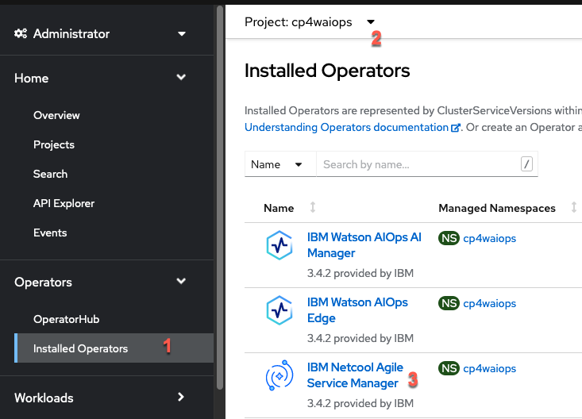
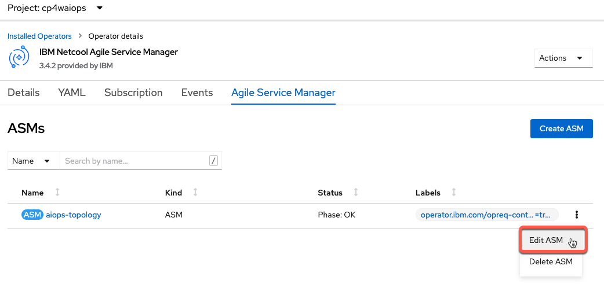

 To follow these instructions, you'll need to set up an AWS account and create an EC2 instance. There will be no charge if you follow these steps, although you will need to provide a credit card -- that's required when you create an AWS account.

 > NOTE: These instructions assume you're using AI Manager, but with slight modifications you can use them for Event Manager as well.

1. Create an EC2 instance. You can find the steps for that in [this HOWTO](../03-howto-capture-aws-alarms). Create the instance and then come back here to continue.

1. In AWS, create an access key.
 
   - Search for and select the IAM console.

      

   - Click on the **My security credentials** link.

      

   - Scroll down to Access Keys and click **Create access key**. Make note of the key and the secret; you'll need them both when you set up the topology observer in AIOps.

1. Determine what AWS region you are using by examining the URL. In this example, it's `us-east-2`.

      

   You now have the information you need from AWS. Now to move to AIOps and configure an observer.

1. Enable the AWS observer. It's not enabled by default; you have to edit the ASM (Topology) operator to enable it.

   - Go to the installed operators for the AIOps namespace and select the **IBM Netcool Agile Service Manager** operator.

      

   - From the list of tabs, choose the **Agile Service Manager** tab on the far right.

   - Click on the three dots to the right on the **aiops-topology** line, then click **Edit ASM**.

      

   - You are now editing the YAML which defines the operator. Hit CMD-F to bring up the search bar, and type `aws`.  You should get two hits; the second one is what you want.  You'll see `awsObserver: false`; change it to `true` and **Save**.

      

   - Wait a few minutes while the operator creates a deployment for AWS. When you see the pod is running, you are ready to proceed.

      

1. Configure an observer in AIOps.

   - Go to the AI Manager home page. The URL is in the route called `cpd` in the `cp4waiops` namespace. The credentials are in the secret called `platform-auth-idp-credentials` in the `ibm-common-services` namespace.

   - Click on the **Data and tool connections** link.

      

   - Click the **Add connection** button at the top right.

   - In the Add connections page, click **Topology** from the list on the left, then click the **configure, schedule, and manage other observer jobs** link.

      

   - Click the **Add a new job** button, then choose the AWS tile.  If it's not there, check the previous step to make sure you enabled the AWS observer and that the pod is running.

   - Fill out the form with the values you've collected, and click **Save**.

      

   - The job should run for a few minutes. When it's done (the status changes from Running to Ready), you can check it's history from the three dots on the tile. Mine shows that it discovered 17 resources.

1. View the AWS resources.

   - From the menu in the top left, click the **Resource management** link.

      

   - You should be on the Resources tab and it should show you how many resources have been observed. Scroll through the list until and select the resource which has the name which matches the EC2 instance in AWS. The type should be `server`.

      

   - You will see the EC2 instance and its nearest relationships.

      

That's it! NOTE: If you add a process (apache, nginx, etc) to the EC2 instance, it *will not* be observed. You will need an APM tool like Instana, or a CMDB, to show it.  
