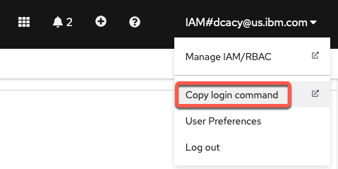

You may want to delete the metric entries for whatever reason, such as at a customer for a POC. Follow these steps. You will need the `oc` application installed on your system.

> NOTE: This procedure only works for the metrics within Event Manager.

1. Log on to OCP from the command line.

   - From the OCP console, click on your name, then on **Copy login command**.

      

   - Click **Display Token** and then copy the `oc login` command.

   - Open a Terminal window and paste that command. You'll see a message about how many projects you can access.

1. Run the job to delete the metrics data.

   - Change to the correct namespace with the command `oc project cp4waiops-evtmgr` if you used Nik's method to install, or `oc project noi` if you used Zane's method.

   - Download [this file](../files/delete-all-metrics-evtmgr.sh) to your system and run it from that same Terminal window. The script scales down the four deployments for metrics, then empties the two tables in the cassandra database where the metrics are stored, and finally scales the deployments back up.

   - The job will take a couple minutes to run. When it's done, you'll be returned to the command line.

      

   - Wait a few minutes for the metrics system to be fully restarted.